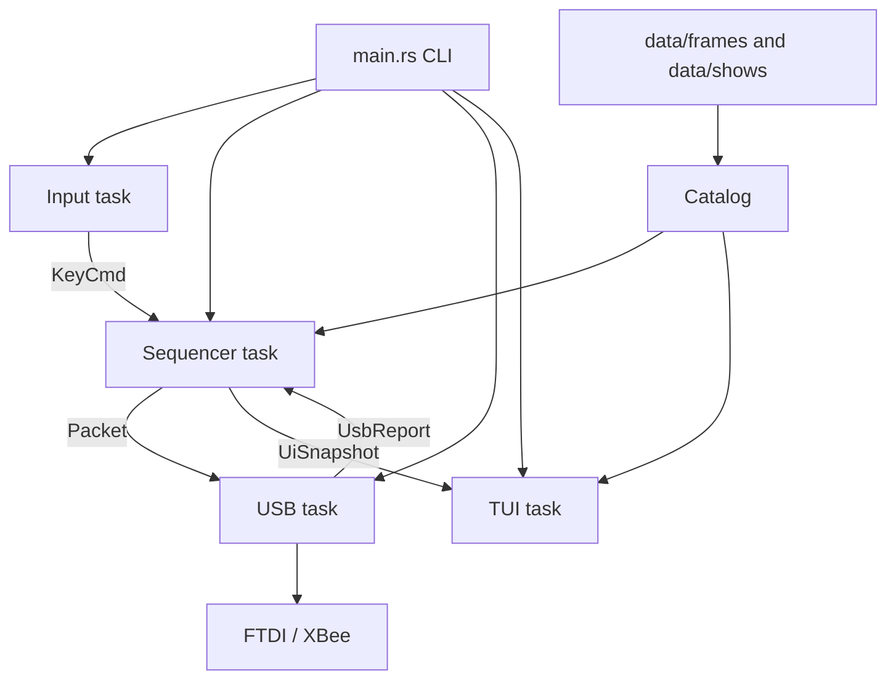

# Requirements

### Overview & Goals
Turn the `rust-sample` demo (`band-lighthshow`) from a C-shaped live console into a maintainable operator tool: data-driven cues, an interruptible runtime, and a dashboard that stays in sync with the show files. Live look of the glasses may change where that makes the program easier to run and extend.

### Scope
#### In Scope
- Restructure `rust-sample` only (ignore `Documents`, `OldCode`, `Tools`).
- Load frames and shows from RON under `data/` (`serde`/`ron` are already in `Cargo.toml` but unused).
- Replace nested `handle_key` loops with Tokio tasks (input, sequencer, USB, UI).
- Generate the Ratatui command grid from loaded shows (each `.show` owns `key`, `name`, `category`).
- Operator CLI: device pick, data dir, dry-run, list devices.
- Simple brightness (`<` / `>`) instead of the current TBA stubs.
- Keep the 97-byte FTDI/XBee wire format (`96 RGB + 0x00`) in `src/xbee.rs`.

#### Out of Scope
- Other repo folders and the original `glasses.c` as a runtime.
- Changing USB VID/PID/baud defaults (still FT232 `0x0403:0x6001`, 57600 8N1) except via CLI if needed.
- A visual show editor or networked multi-operator control.

### User Stories
- As an operator, I want `,` and `.` (and Ctrl-C) to stop or quit immediately, even mid-cue.
- As an operator, I want to add or tweak a cue by editing a file, not a 400-line match arm.
- As an operator, I want the dashboard keys to match what is actually loaded.
- As an operator, I want `--list-devices` / `--device` / `--dry-run` so rehearsal does not require guessing the first FTDI.
- As a developer, I want the engine testable without hardware.

### Functional Requirements
- Startup loads `data/frames` and `data/shows` (path overridable). Duplicate hotkeys fail fast with a clear error.
- Global keys stay in code: `,` stop, `.` / Ctrl-C quit, `<` dim, `>` brighten. All other keys come from show files.
- Sequencer interprets opcodes (`Hold`, `Loop`, `Rotate13`, `MarqueeLeft`/`Right`, working-buffer load). Looping shows run until Stop.
- USB task is the only writer to FTDI; errors surface on the dashboard without tearing down the TUI.
- Idle does **not** blindly broadcast `DARK` after every tick (C leftover). Dark is an explicit cue or stop behavior.
- Brightness is a gain applied to outgoing RGB (clamped), not a TBA status string.

### Non-Functional Requirements
- Packet cadence should stay in the tens of milliseconds; task hops must not add unbounded delay (deadline-based steps, USB task only writes).
- Engine and RON parsing covered by unit tests; UI still uses `ratatui::backend::TestBackend`.
- Clippy pedantic remains a warn lint; no new `unwrap` on USB/IO in the happy path.

# Technical Design

### Current Implementation
The binary is a thin Tokio `main` in `src/main.rs`: enumerate FTDI, open the first device, init Ratatui, then loop `poll_key` → `App::handle_key` → always `send(&DARK)`.

`src/routines.rs` is the bottleneck: `App` owns `Xbee`, mutable packets (`snowman*`, `tree*`, `sorc`), and `UiState`. `handle_key` is a ~400-line `match` that inlines every cue. Looping cues nest `loop { poll_key(); flash... }` and sample the keyboard **once per cycle**, so Stop waits until the sequence finishes. Command names/keys are duplicated in `term.rs::get_categories`.

`src/patterns.rs` is ~1000 lines of `[u8; 96]` constants plus `rotate13` / `marquee_left` / `marquee_right`. `src/timing.rs` holds C-era names (`DAB`, `SLP`, `PHISH`, …). `clap::Parser` `Args` is empty. `data/fames/` (typo) and `data/shows/white_flash.show` are unused, as are `serde`/`ron`.

### Key Decisions
- **Tokio tasks, not one App loop.** Input, sequencer, and USB are separate tasks. The TUI task owns `Terminal` (draw only); the input task only reads crossterm events so stdout is not shared.
- **Frames + opcodes.** Named 96-byte frames on disk; shows are small programs. Procedural effects stay opcodes (not pre-expanded timelines).
- **Hotkeys live in each show file.** Dashboard and dispatcher are generated from the loaded catalog. Global stop/quit/brightness stay in Rust.
- **Library + thin binary.** Move domain code behind `src/lib.rs`; `main.rs` parses CLI and spawns tasks.
- **Behavior may change.** Drop post-tick `DARK`, fix stop latency, implement brightness, allow key/name cleanup in the RON port.

### Architecture Diagram


### Data Models / Contracts
Frame file (`data/frames/*.frame` or a set file):
```ron
Frame(
  name: "white",
  rgb: [255, 255, 215, /* 32 x RGB */],
)
```
A file may also be a `FrameSet({ "falldown_0": [...], ... })` so related packets stay together.

Show file (`data/shows/*.show`):
```ron
Show(
  key: 'c',
  name: "Christmas Sparkle",
  category: "Twinkles & Sparkles",
  desc: "4-phase sparkle loop",
  looping: true,
  program: [
    Hold(frame: "x1", wait: "slp"),
    Hold(frame: "dark", wait: "slp"),
    // ...
  ],
)
```

Engine ops (Rust):
```rust
enum Op {
    Hold { frame: String, wait: Wait },      // named timing or ms
    LoadWorking { frame: String },
    HoldWorking { wait: Wait },
    Rotate13,
    MarqueeLeft,
    MarqueeRight,
}

enum Wait { Named(String), Ms(u64) }
```
`looping: true` repeats the program until Stop. Working-buffer ops cover snowman/tree (`Rotate13`) and marquees.

Task messages:
```rust
enum KeyCmd { Char(char), Quit }
struct PacketMsg { packet: Packet }
enum UsbReport { Ok, Err(String) }
```
`UiState` stays the dashboard snapshot (`current_routine`, `loop_status`, `last_packet`, error, …) but `get_categories()` is built from `Catalog`.

CLI (`clap`):
- `--list-devices`
- `--device <index>` (default 0)
- `--data-dir <path>` (default `data`)
- `--dry-run` (no FTDI; sequencer still runs, USB task is a sink)

### Proposed Changes
- Add `src/lib.rs` and modules `catalog`, `engine`, keep `patterns` (type + transforms only), `term`, `xbee`, `timing`.
- Replace `App::handle_key` / `routines.rs` with `engine::Player` + sequencer task.
- Input task: non-blocking/async key stream; map Ctrl-C to Quit; send chars to sequencer.
- Sequencer: catalog lookup on key; advance ops on `Instant` deadlines; apply brightness; send packets; publish `UiSnapshot`. `,` resets to idle (optional dark packet once).
- USB task: `Xbee::frame` + `write_all`; report errors. Do not open the device on `--dry-run`.
- TUI task: receive snapshots, `Terminal::draw`. Command grid from catalog, not a hardcoded `get_categories`.
- Rename `data/fames` → `data/frames`. Port every current cue to `.show` + shared frames (`dark`, colors, `twnk*`, `x*`, `rain*`, `vandal_*`, `falldown_*`, `ig`, snowman/tree).
- Brightness: sequencer holds a `u8` scale (e.g. steps of 16); multiply RGB on emit.
- Drop empty `Args` stub; drop always-send-`DARK` in `main`.

### File Structure
- **Add:** `src/lib.rs`, `src/catalog.rs`, `src/engine.rs`, `data/frames/*.frame`, `data/shows/*.show` (one per cue).
- **Rewrite:** `src/main.rs` (CLI + task spawn + graceful shutdown via `CancellationToken` or close of channels).
- **Slim:** `src/patterns.rs` (keep `Packet`, `CHANNELS`, `PACKET_LEN`, `rotate13`, marquees); `src/routines.rs` **remove** (logic moves to engine + sequencer).
- **Update:** `src/term.rs` (catalog-driven grid; tests for generated categories); `src/xbee.rs` (usable behind the USB task; keep framing tests); `src/timing.rs` (map names for RON `wait: "slp"`).
- **Remove/rename:** `data/fames/`, unused demo `white_flash.show` shape.

### Risks
- **Timing jitter** from channel hops — mitigate with a dedicated USB writer, pre-framed bytes, and deadline-based `sleep_until` in the sequencer (not “sleep then maybe send”).
- **Hotkey clashes** in show files — reject catalog load on duplicates.
- **Crossterm vs two tasks** — only the input task reads events; only the TUI task draws.
- **Missing frames** at load — validate every `Hold` name when the catalog loads, not mid-show.

# Testing

### Validation Approach
Prefer unit tests that do not need FTDI. Use `cargo test` in `rust-sample` and `ratatui::backend::TestBackend` for dashboard rendering. Engine tests drive `Player` with a fake clock or explicit `advance()`.

### Key Scenarios
- Parse a `Frame` / `FrameSet` and a looping `Show` from RON (including `wait: "slp"` via `timing`).
- Catalog merges frames, indexes shows by key, and fails on duplicate keys or unknown frame names.
- Player: one-shot Hold sequence emits the right packets and waits; looping show repeats until `stop()`.
- `Rotate13` / marquee opcodes match existing `patterns.rs` tests (move those tests next to the engine or keep them on the transform fns).
- Sequencer maps `,` to idle and `.` to shutdown without waiting for the rest of a cycle.
- UI render includes a show name loaded from catalog and still shows ERROR + `[LOOPING]`.
- `--dry-run` path: sequencer runs with a USB sink (manual or a small unit test around the sink).

### Edge Cases
- Empty `data/shows` — start idle with a status message, do not panic.
- Unknown key — ignore (idle tick), do not crash.
- USB write error — snapshot `is_error`, continue running.
- Constrained terminal size — keep the existing no-panic render test.
- Brightness 0 — packets become dark; brightness max — identity.

### Test Changes
- Move `UiState` init tests out of `routines.rs` into `term.rs` (already duplicated there).
- Add `catalog` and `engine` test modules.
- Keep `Xbee::frame` and marquee/rotate tests.
- Do not add hardware integration tests.

# Delivery Steps

### ✓ Step 1: Define RON frame/show schema and catalog loader
Frames and shows load from disk into a validated Catalog, with the `fames` typo gone.

- Add `src/lib.rs` and `src/catalog.rs` with `Frame`, `FrameSet`, `Show`, `Op`, `Wait` types (`serde` + `ron`).
- Implement loader for `--data-dir` (default `data/`): merge frames into a name map, collect shows, error on duplicate keys or missing frame refs.
- Rename `data/fames/` to `data/frames/` and replace the stub `white_flash.show` with the new `Show` shape plus a couple of real frames (`dark`, `white`) as fixtures.
- Map `timing.rs` names so RON can use `wait: "slp"` as well as raw milliseconds.
- Unit tests: parse fixtures, reject duplicate hotkeys, reject unknown frame names.

### ✓ Step 2: Implement the opcode player without hardware
A testable `Player` runs Hold/Loop/Rotate/Marquee programs and emits packets on demand.

- Add `src/engine.rs` with a working buffer, program counter, looping flag, and `stop()`.
- Reuse `rotate13` / `marquee_*` from `src/patterns.rs`; slim that file down to `Packet` + transforms (no need to move every constant yet).
- Drive steps with explicit deadlines (`Instant` + `Wait`) so the later sequencer can `sleep_until` instead of nested `flash` loops.
- Unit tests for one-shot sequences, looping until stop, rotate/marquee working-buffer shows, and brightness scaling on emit.

### ✓ Step 3: Split runtime into input, sequencer, USB, and TUI tasks
`main` spawns four cooperating tasks; nested `handle_key` loops are gone.

- Rewrite `src/main.rs` to parse CLI, load the catalog, open FTDI (or a dry-run sink), and spawn: input (crossterm keys → `KeyCmd`), sequencer (`Player` + catalog), USB (`Xbee::send` / sink), TUI (`Terminal::draw`).
- Sequencer owns show state: start on catalog key, stop on `,`, quit on `.` / Ctrl-C, publish `UiSnapshot`, apply brightness.
- Only the TUI task draws; only the input task reads events; only the USB task writes the device.
- Delete `src/routines.rs` once `App::handle_key` is replaced; drop the always-`send(&DARK)` idle path.
- Graceful shutdown: cancel tasks, `Drop` restores the terminal, `Xbee::close` flushes.

### ✓ Step 4: Port every live cue into show files and drive the dashboard from the catalog
All current hotkeys exist as `data/shows/*.show`; the command grid is generated, not hardcoded.

- Extract RGB constants from `src/patterns.rs` into `data/frames` (solids, twinkles, rain, vandal letters, falldown set, IG, snowman/tree).
- Write one `.show` per current cue (`b` blue flash, `c` christmas sparkle, `1`–`7`, marquees, etc.) with `key` / `name` / `category` / `program`.
- Change `term.rs::get_categories` to build cards from `Catalog` (keep the four category titles unless a show file introduces a new one).
- Update UI tests to use a small in-memory catalog instead of a hardcoded list of 25+ commands.
- Operator CLI: `--list-devices`, `--device`, `--data-dir`, `--dry-run`; implement `<` / `>` as a packet gain instead of TBA strings.