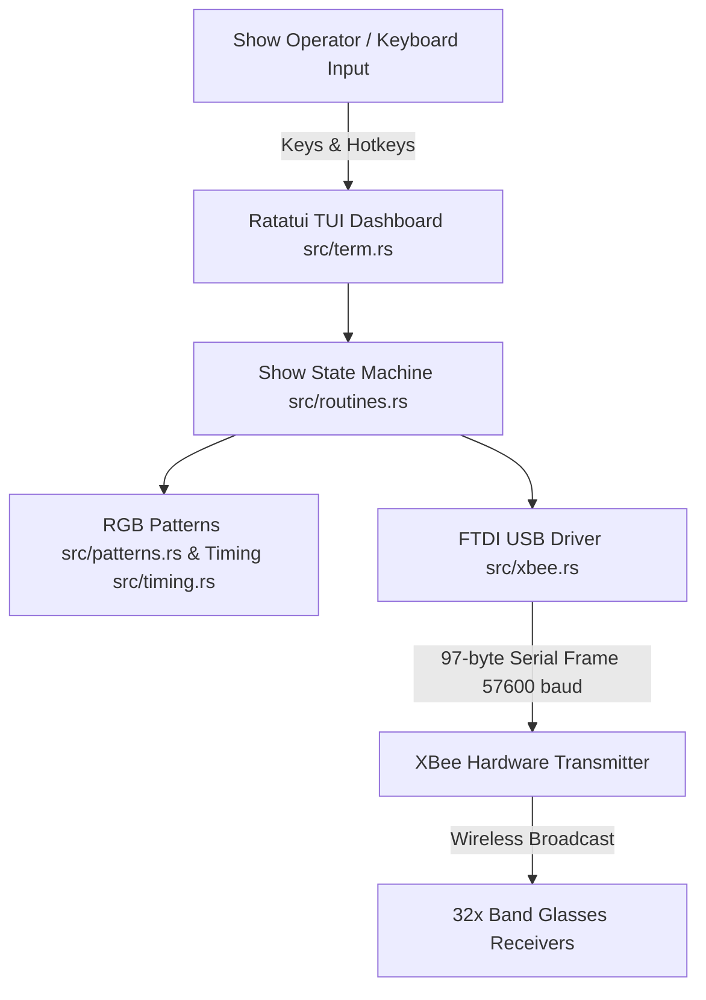

# Requirements

### Overview & Goals
The objective is to produce a comprehensive, structured `README.md` in `rust-sample` that documents the `band-lighthshow` Rust application. The documentation will serve both live show operators and software maintainers by detailing system architecture, hardware requirements, hotkey controls, wire protocols, and build/run workflows.

### Scope
- **In Scope**:
  - Clear high-level overview of the Halftime Light Show Toolkit and its Ratatui TUI dashboard.
  - Hardware connection requirements (FTDI FT232 USB UART, 57600 8N1, XBee wireless broadcast, 32 RGB channel receivers).
  - Complete command matrix categorized by pattern type (Flashes, Twinkles, Animations, Specials, Global Controls).
  - Wire protocol specifications (97-byte packet structure: 96 RGB payload + `0x00` terminator).
  - Module architecture breakdown (`main.rs`, `patterns.rs`, `routines.rs`, `term.rs`, `timing.rs`, `xbee.rs`).
  - Build, run, and test instructions using `cargo`.
  - Troubleshooting guidelines for FTDI USB enumeration and terminal restoration.
- **Out of Scope**:
  - Modifying application source code or build configuration in `rust-sample`.
  - Creating documentation outside `rust-sample`.

### User Stories
- **As a show operator**, I want a clear hotkey cheat-sheet and operational guide so that I can reliably trigger light routines during performances without looking at source code.
- **As a hardware/firmware engineer**, I want precise protocol and timing specifications so that receiver firmware compatibility is maintained.
- **As a developer/maintainer**, I want a clear architecture overview and build/test instructions so that I can extend patterns and maintain the codebase efficiently.

### Functional Requirements
- High visual legibility using structured tables, code fences, and Markdown formatting.
- Accurate mapping of all 25+ show routines and their keybindings.
- Direct alignment with the implementation in `rust-sample/src/`.

# Technical Design

### Current Implementation
The `rust-sample` directory contains the `band-lighthshow` crate (Rust edition 2024):
- `src/main.rs`: Application entry point, FTDI device enumeration, event loop, and clean shutdown.
- `src/patterns.rs`: ~75 static 96-byte RGB pattern definitions, `rotate13`, and marquee shift logic.
- `src/routines.rs`: State machine executing one-shot pulses, looping animations, and UI state tracking.
- `src/term.rs`: Ratatui 0.30 dashboard, crossterm raw mode manager, 4-panel routine cards, status monitor, and RGB channel visualizer.
- `src/timing.rs`: Microsecond timing constants (`DAB`, `SLP`, `DASH`, `DOT`, `FAST`, `SLO`, `DROOL`, etc.).
- `src/xbee.rs`: `ftdi-nusb` async driver, 97-byte wire packet constructor, and serial communication.

### Document Structure for `rust-sample/README.md`
1. **Title & Badge Header**: Project name, version, edition, and high-level description.
2. **Features**: Summary of Ratatui TUI, pure Rust USB driver, and zero-latency microsecond timing.
3. **Hardware Architecture & Wiring**:
   - FTDI FT232 device parameters (VID `0x0403`, PID `0x6001`, 57600 baud, 8N1).
   - XBee wireless serial transmitter topology.
   - 32-channel RGB wireless glasses.
4. **Wire Protocol Specification**:
   - 97-byte frame diagram (Bytes 0–95: RGB data for 32 channels, Byte 96: `0x00` frame delimiter).
   - Implicit dark packet broadcasting behavior during idle ticks.
5. **Operator Guide & Hotkey Matrix**:
   - Flashes & Solids (`r`, `e`, `b`, `g`, `w`, `m`, `y`, `k`, `d`, `n`, `o`)
   - Twinkles & Sparkles (`a`, `c`, `q`, `x`, `z`, `f`, `h`, `j`, `l`)
   - Animations & Marquees (`s`, `p`, `[`, `]`, `6`, `7`)
   - Holiday & Specials (`1`, `2`, `3`, `4`, `5`, `t`)
   - Navigation (` `, `,` stop loop, `.` / `Ctrl+C` exit, `<`/`>` dimmer stubs)
6. **Codebase Architecture**:
   - Table describing the role of each source file in `src/`.
7. **Building & Running**:
   - Prerequisites (Rust toolchain, OS permissions for FTDI devices).
   - `cargo build --release`
   - `cargo run`
   - `cargo test`
8. **Troubleshooting**:
   - Resolving "no ftdi devices found".
   - Recovering terminal raw mode on abnormal termination.

### Architecture Diagram

### File Changes
- **Target File**: `/Users/paulshannon/RustRoverProjects/MBGlasses/rust-sample/README.md` (new documentation file).

# Delivery Steps

### * Step 1: Draft Project Overview, Hardware Architecture, and Prerequisites
The root section of `rust-sample/README.md` will contain the project summary, hardware requirements, and system setup instructions.

- Document the project purpose: Ben's Halftime Light Show Toolkit ported to Rust edition 2024 with a Ratatui TUI.
- Specify the required hardware stack: FTDI FT232 USB-to-UART adapter (VID 0x0403, PID 0x6001), 57600 baud 8N1 link, XBee transmitter, and 32-channel RGB wireless glasses receivers.
- Document OS prerequisites, USB permissions, and dependency requirements (`ftdi-nusb`, `nusb`, `crossterm`, `ratatui`, `tokio`).

###   Step 2: Document Hotkey Matrix, Operational Controls, and Wire Protocol Specification
The README will contain an exhaustive hotkey reference and complete wire framing specifications.

- Document all operational hotkeys organized by category (Flashes & Solids, Twinkles & Sparkles, Animations & Marquees, Holiday & Specials, and Global Controls `,` / `.`).
- Detail the 97-byte packet protocol: 32 channels × 3 RGB bytes (96 bytes) terminated by a trailing `0x00` null byte.
- Document microsecond timing constants (`DAB`, `SLP`, `DASH`, `DOT`, `FAST`, `SLO`, `DROOL`, `PHISH`) and loop execution behavior.

###   Step 3: Add Build, Run, Testing Instructions, and Module Architecture Breakdown
The README will include build/test commands, module architecture breakdown, and developer guidelines.

- Provide standard Cargo commands: `cargo build`, `cargo run`, and `cargo test`.
- Include a project structure guide detailing the responsibilities of `main.rs`, `patterns.rs`, `routines.rs`, `term.rs`, `timing.rs`, and `xbee.rs`.
- Include troubleshooting tips for common operational issues such as missing FTDI device detection and raw terminal restoration.