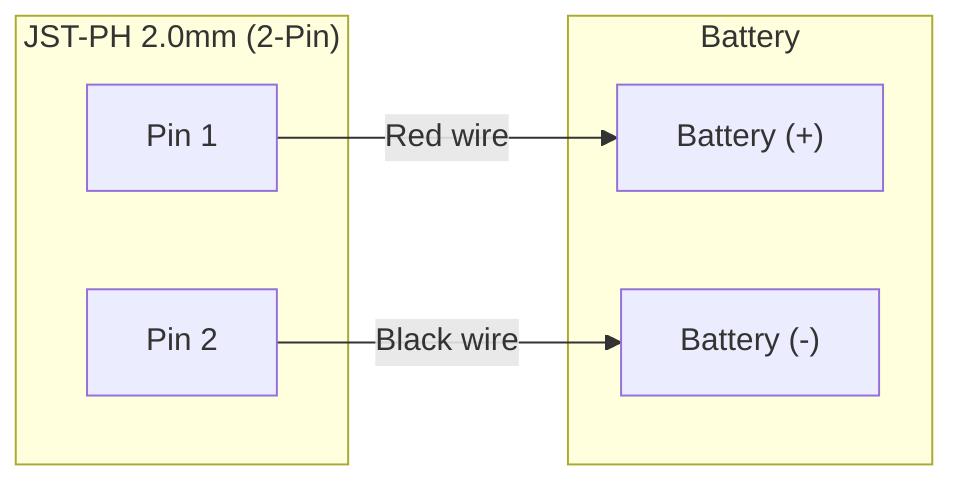
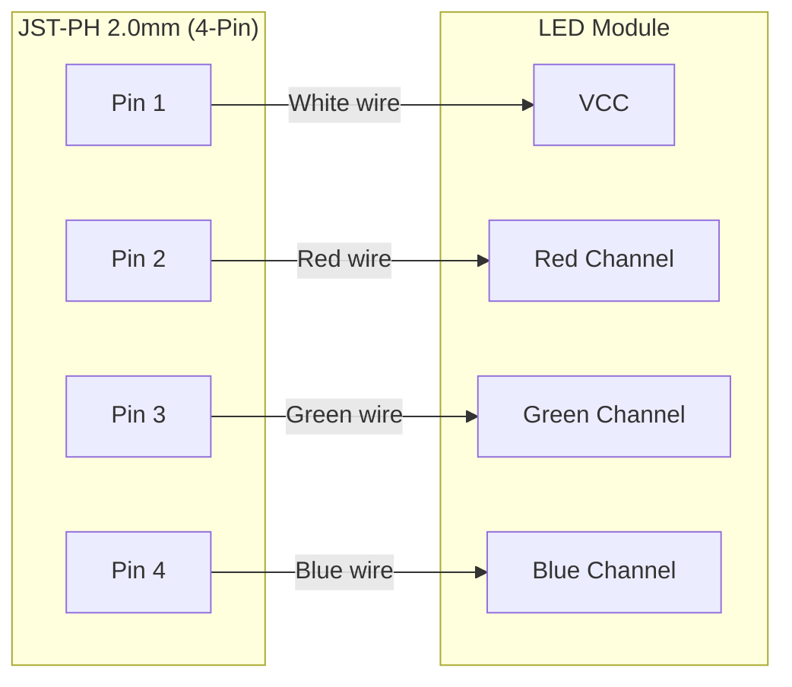

# Requirements

### Overview & Goals
Document the electrical wiring pinouts for the glasses repair in `Documents/glasses.md` using clear Mermaid diagrams and markdown reference tables.

### Scope
- **In Scope:**
  - Battery Harness wiring details (Pin 1: Red / Battery +, Pin 2: Black / Battery -).
  - LED Harness wiring details (Pin 1: White / VCC, Pin 2: Red / Red, Pin 3: Green / Green, Pin 4: Blue / Blue).
  - Visual Mermaid diagrams representing connectors, pins, wire colors, and signal destinations.
  - Updating `Documents/glasses.md` under the `## Documentation` section while keeping existing repair findings intact.
- **Out of Scope:**
  - Modifying code in `rust-sample` or other directories.
  - Changing hardware schematics or unrelated documentation files.

### Pinout Specifications
- **Connector Type:** JST-PH 2.0mm
- **Battery Harness (2-Pin JST-PH):**
  - Pin 1: Red wire -> `Battery +`
  - Pin 2: Black wire -> `Battery -`
- **LED Harness (4-Pin JST-PH):**
  - Pin 1: White wire -> `VCC`
  - Pin 2: Red wire -> `Red LED`
  - Pin 3: Green wire -> `Green LED`
  - Pin 4: Blue wire -> `Blue LED`

### Acceptance Criteria
- `Documents/glasses.md` contains accurate pinout tables for both harnesses.
- Mermaid diagrams are embedded in `Documents/glasses.md` and render correctly in Markdown viewers.
- Existing repair notes regarding reversed polarity / swapped leads in findings remain intact.

# Technical Design

### Current Implementation
- File: `Documents/glasses.md`
- Contains notes that connectors are `JST-PH 2.0MM` and placeholder text `Wiring changed to as follows`, followed by repair findings.

### Proposed Changes
Update `Documents/glasses.md` to include:
1. Pinout reference tables under `## Documentation`.
2. Mermaid diagrams visualizing the connection from the JST-PH 2.0mm pin headers to the respective wires and endpoints.

### Diagram Specifications

#### Battery Harness Diagram

#### LED Harness Diagram

### File Structure Changes
- **Modified:** `Documents/glasses.md` (no files created or deleted).

# Testing

### Validation Approach
- Verify that `Documents/glasses.md` renders cleanly in standard Markdown and Mermaid previewers without syntax errors.
- Cross-check that all pin assignments, wire colors, and signal destinations match the user specification exactly:
  - Battery +: Red -> Pin 1
  - Battery -: Black -> Pin 2
  - VCC: White -> Pin 1
  - Red: Red -> Pin 2
  - Green: Green -> Pin 3
  - Blue: Blue -> Pin 4
- Verify that existing sections (`# Glasses`, `## Findings`) remain intact.

# Delivery Steps

### ✓ Step 1: Add structured pinout tables to glasses.md
The wiring pinout tables for both the Battery Harness and the LED Harness are clearly documented in `Documents/glasses.md`.

- Add a structured subsection for the Battery Harness under `## Documentation` with connector type (JST-PH 2.0mm 2-pin) and pinout table (Pin 1: Red / Battery +, Pin 2: Black / Battery -).
- Add a structured subsection for the LED Harness under `## Documentation` with connector type (JST-PH 2.0mm 4-pin) and pinout table (Pin 1: White / VCC, Pin 2: Red / Red, Pin 3: Green / Green, Pin 4: Blue / Blue).
- Ensure existing notes regarding connector types and findings are properly preserved and aligned.

### ✓ Step 2: Embed Mermaid wiring diagrams in glasses.md
Interactive Mermaid wiring diagrams for the Battery and LED harnesses are embedded directly into `Documents/glasses.md`.

- Add a Mermaid wiring diagram representing the Battery Harness JST-PH 2.0mm connector with pin numbers, wire colors (Red, Black), and signals (Battery +, Battery -).
- Add a Mermaid wiring diagram representing the LED Harness JST-PH 2.0mm connector with pin numbers, wire colors (White, Red, Green, Blue), and LED signal channels (VCC, Red, Green, Blue).
- Validate Markdown and Mermaid diagram formatting for clean visual rendering.