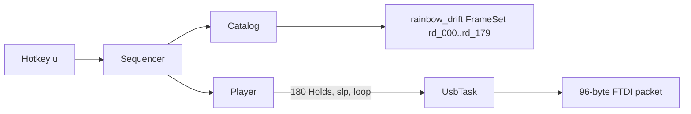

# Requirements

### Overview & Goals
Rebuild hotkey **`u`** as a **spatial rainbow that drifts**: every channel stays lit, hues form a spectrum along wire indices 0–31, and the whole rainbow slides through **180** phase steps with no black/dark rest. Test RGB (`t`) is unchanged.

### Scope
#### In Scope
- Replace the seven-mix program in `data/shows/full_rgb.show` (`key: 'u'`).
- Check in **180** full-saturation packets (linear HSV along the 32 channels, phase += 2° per frame).
- Looping `Hold` list at `slp` (40 ms); no blank frames.
- HSV helper in `patterns.rs` so the on-disk bytes can be generated and unit-tested.
- Catalog fixture assertions for the new cue.

#### Out of Scope
- New engine opcodes, Player phase state, or `runtime.rs` / USB / TUI changes.
- Expanding frames at `Catalog::load` (packets live on disk).
- Changing Test RGB (`t`) or the existing `rain*.frame` / Rainbow Short/Med shows.
- Deleting `FULL_RGB` / `full_rgb.frame` (still valid fixtures; the show no longer holds that solid).
- Nested 0–255 RGB sweep.

### User Stories
- As an operator, I want `u` to look like a smooth rainbow across the glasses, not seven solid jumps.
- As a hardware tester, I want every channel lit for the whole loop, with hues creeping so load keeps moving around the RGB LEDs.

### Functional Requirements
- Press `u`: dashboard shows a rainbow-drift name; all 32 channels display a linear spectrum.
- Each tick advances phase by 2° (`180` unique packets per revolution) and holds `slp`.
- After `rd_179` the looping show wraps to `rd_000`.
- No `black` or `dark` in the program; `,` still stops with `DARK`.

### Non-Functional Requirements
- Data + a pure HSV helper; Player remains Hold-only.
- Packets stay 96 bytes. One `FrameSet` file rather than 180 separate `.frame` files.

# Technical Design

### Current Implementation
- `u` is `data/shows/full_rgb.show`: seven lockstep `Hold`s (red…`full_rgb`) at `dash`.
- Player (`engine.rs`) only emits named frames / working-buffer ops; catalog comment: procedural effects should stay tiny — **user chose checked-in frames instead of a new opcode**.
- `Catalog` already parses `FrameSet({ name: [u8;96], ... })` in `catalog.rs` (`parse_frame_file`).
- Existing `rain1`–`rain8` are coarse mixed palettes, not a 180-step gradient.
- Channel order for this cue is **wire index 0..31** (same as marquee), not the `rotate13` banks.

### Key Decisions
- **Checked-in frames, one FrameSet.** Honor “no engine opcode” without 180 tiny files. `data/frames/rainbow_drift.frame` holds `rd_000`…`rd_179`.
- **Linear hue.** Channel `i` at step `n`: `hue = (n * 2 + i * 360 / 32) % 360`, `S = V = 255`.
- **Replace `u`.** Rename the show to Rainbow Drift; keep `full_rgb.frame` / `FULL_RGB` as unused solids.
- **`slp` pacing.** 180 × 40 ms ≈ 7.2 s per revolution — cinematic without a new wait name.
- **HSV helper in `patterns.rs`.** Used to generate the RON and to assert catalog bytes; not called from Player.

### Proposed Changes
1. Add `hsv_to_rgb(h: u16, s: u8, v: u8) -> [u8; 3]` and `rainbow_drift_packet(step: u16) -> Packet` in `patterns.rs` (`step` in `0..180`).
2. Add `data/frames/rainbow_drift.frame` as a `FrameSet` of 180 packets named `rd_000`…`rd_179` (bytes match `rainbow_drift_packet`).
3. Rewrite `data/shows/full_rgb.show`:

```ron
Show(
    key: 'u',
    name: "Rainbow Drift",
    category: "Animations & Marquees",
    desc: "Spatial rainbow on all 32 channels, 180-step hue drift, no blank",
    looping: true,
    program: [
        Hold(frame: "rd_000", wait: "slp"),
        // ... rd_001 .. rd_178 ...
        Hold(frame: "rd_179", wait: "slp"),
    ],
)
```

4. Update `load_repo_fixtures`: show `'u'` is Rainbow Drift, 180 Holds, no `black`/`dark`, `frame("rd_000") == rainbow_drift_packet(0)` (and a mid/end spot). Keep `full_rgb` / Test RGB assertions.

### Data Models / Contracts
```text
hsv_to_rgb(h: 0..=360, s, v) -> [r,g,b]
rainbow_drift_packet(step: 0..180) -> Packet
  ch i: hsv_to_rgb((step * 2 + i * 360 / 32) % 360, 255, 255)
```

### Architecture Diagram


### File Structure
| File | Action |
| :--- | :--- |
| `rust-sample/src/patterns.rs` | Add HSV + `rainbow_drift_packet`; unit tests |
| `rust-sample/data/frames/rainbow_drift.frame` | New FrameSet, 180 packets |
| `rust-sample/data/shows/full_rgb.show` | Replace 7-mix program with 180 Holds |
| `rust-sample/src/catalog.rs` | Fixture assertions for drift frames / `'u'` |
| `rust-sample/src/engine.rs` / `runtime.rs` | Unchanged |
| `rust-sample/data/frames/full_rgb.frame` | Unchanged |

### Risks
- **Repo size:** one ~70KB FrameSet is acceptable; do not split into 180 files.
- **HashMap key order:** show lists `rd_000`…`rd_179` explicitly so load order does not matter.
- **Integer hue:** `i * 360 / 32` truncates (~11° per channel); good enough vs float HSV.
- **Heat:** still a full-sat test; stop with `,`.

# Testing

### Validation Approach
Unit tests only (no FTDI). Patterns tests for HSV/rainbow math; `Catalog::load` for disk bytes and the `u` program.

### Key Scenarios
- `hsv_to_rgb(0,255,255)` is red, `120` green, `240` blue, `60` yellow.
- `rainbow_drift_packet(0)` channel 0 is red; channel 16 is ~180° (cyan).
- `frame("rd_000")` / `rd_090` / `rd_179` match the helper.
- Show `'u'` name Rainbow Drift, `looping`, 180 `Hold`s at `slp`, no `black`/`dark`.
- Test RGB (`t`) still includes black/dark; `full_rgb` frame still loads.

### Edge Cases
- `step` 0 and 179 wrap cleanly; hue `% 360`.
- Unknown wait names still rejected by existing catalog validation.
- Dry-run USB path unchanged.

# Delivery Steps

### ✓ Step 1: Add HSV helper and rainbow packet builder
`patterns.rs` can compute a 32-channel spatial rainbow for any 2° phase step.

- Add `hsv_to_rgb` (standard 6-sector, `h` in 0..=360) and `rainbow_drift_packet(step)` in `rust-sample/src/patterns.rs`.
- Channel `i` uses `hue = (step * 2 + i * 360 / 32) % 360` at full saturation/value.
- Unit-test primary hues and a couple of spatial spots (ch 0 vs ch 16 at step 0).

### ✓ Step 2: Check in the 180-frame FrameSet
All drift packets exist on disk as one `FrameSet` the catalog already knows how to load.

- Add `rust-sample/data/frames/rainbow_drift.frame` with keys `rd_000`…`rd_179`.
- Payload for `rd_NNN` is exactly `rainbow_drift_packet(NNN)` (generate from the helper, do not hand-edit RGB).
- Do not add 180 separate `.frame` files.

### ✓ Step 3: Replace the u show and catalog fixtures
Pressing `u` loops the spatial rainbow at `slp` with no blank frames.

- Rewrite `rust-sample/data/shows/full_rgb.show`: name `Rainbow Drift`, category `Animations & Marquees`, `looping: true`, 180 `Hold`s `rd_000`…`rd_179` with `wait: "slp"`.
- Update `load_repo_fixtures` in `catalog.rs` for the new name, length 180, `slp`, no blanks, and spot-check frames against `rainbow_drift_packet`.
- Leave `test_rgb.show`, `engine.rs`, `runtime.rs`, and `full_rgb.frame` unchanged.