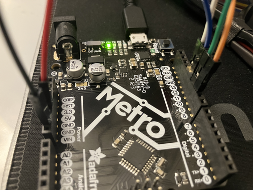
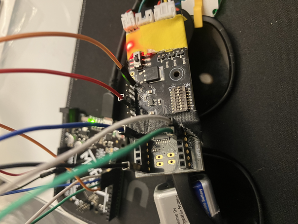

# Programming the glasses with ISP

## Requirements
In order to program the glasses using ISP, you will need a few things
1) A compatible Arduino (Metro, Uno, etc...)
2) A pair of glasses
3) 6 Jumper cables
    * Recommended: 
        * 1 male to female red cable
        * 1 male to male black cable
        * 1 male to male white cable
        * 1 male to male green cable
        * 1 male to male blue cable
        * 1 male to male orange cable
4) A USB cable to connect your Arduino to your computer

## Prerequisites
1) Install the [Arduino IDE](https://www.arduino.cc/en/software/)
1) Copy the contents of the [board config](../../Resources/boards_append.txt) to end of your boards.txt file.   
    * In Linux, this may be found under `/home/{user}/.arduino15/packages/arduino/hardware/avr/1.8.8/boards.txt` 
    * In Windows it may be under `C:\Users\{user}\AppData\Local\Arduino15\packages\arduino\hardware\avr\1.8.8\boards.txt` or `C:\Users\{user}\Documents\ArduinoData\packages\arduino\hardware\avr\1.8.8\boards.txt` 
    * In MacOS it may be under `/Users/{user}/Library/Arduino15/packages/arduino/hardware/avr/1.8.8/boards.txt`

## Steps
1) Install an ISP programmer on your Arduino using the built in example
    1) Open Arduino IDE
    2) Click File -> Examples -> 11. Arduino ISP -> Arduino ISP
    3) Plug in your Arduino to your computer
    4) Configure the board (ex. Arduino UNO on Port /dev/ttyUSB0)
    5) Hit "upload"
2) Unplug the Arduino from your computer
3) Plug in the cables between the Arduino and the glasses as follows
    1) Remove the MRF wireless receiver
    2) Use the red wire to connect 5v on the Arduino to the VCC header on the glasses (3rd in on the right when looking at the glasses PCB right side up)
    3) Use the black wire to connect ground on the Arduino to ground on the Glasses (bottom right connector on the MRF connector)
    4) Use the white wire to connect pin 13 on the Arduino to the upper right hand connector in the MRF connector
    5) Use the blue cable to connect pin 12 on the Arduino to the bottom left connector in the MRF connector
    6) Use the green wire to connect pin 11 on the Arduino to the connector immediately next to the white wire on the MRF connector
    7) Use the orange wire to connect pin 10 on the Arduino to the reset through hole on the glasses PCB (may be under tape, rightmost hole)
    8) Final results should look something like this

    <table style="width:100%; border:none;">
    <tr>
        <td style="text-align:center; width:50%; border:none;">
        
         <em>Arduino Wiring</em>
        </td>
        <td style="text-align:center; width:50%; border:none;">
        
         <em>Glasses Wiring</em>
        </td>
    </tr>
    </table>

4) Plug in the Arduino to your computer again. You should see the power LEDS on the Arduino and the glasses light up
5) Load the program which you wish to put on the glasses in the Arduino IDE.
6) Change the board from the Arduino to Bob's Goofy Controller
7) Either hit CTRL + SHIFT + U or click Sketch -> Upload using programmer