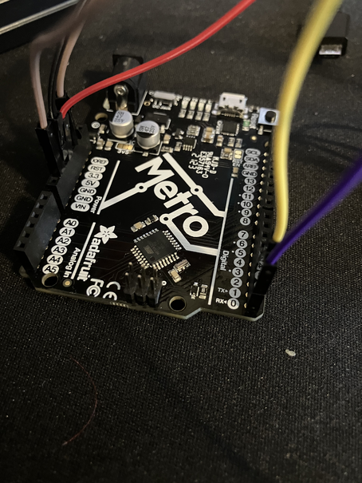
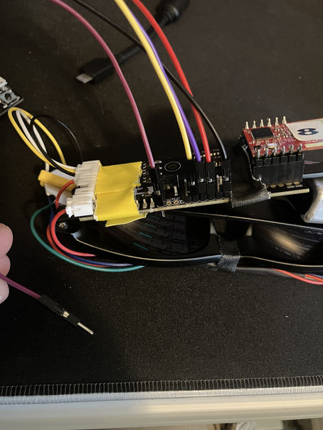
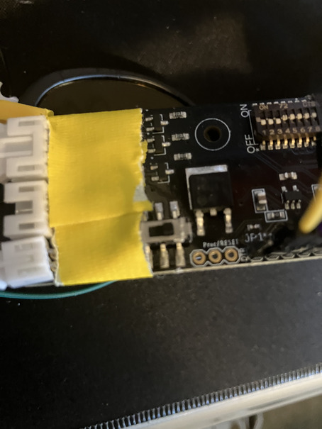

# Programming the glasses with Serial

## Requirements
In order to program the glasses using Serial, you will need a few things
1) A compatible Arduino (Metro, Uno, etc...)
2) A pair of glasses
3) 5 Jumper cables
    * Recommended: 
        * 1 male to female red cable
        * 1 male to female black cable
        * 1 male to male purple cable
        * 1 male to male yellow cable
        * 1 male to male maroon cable
4) A USB cable to connect your Arduino to your computer

## Prerequisites
1) Wire your Arduino to the glasses as described in [Programming with ISP](./Program_ISP.md)
2) Flash Arduino ISP ont your Arduino, as described in [Programming with ISP](./Program_ISP.md)
3) Ensure your Arduino is plugged in, and that its power LED and the glasses power LEDs are on
4) Run the [bootloader flasher command](../../../Tools/Bootloader/install_bootloader.sh)

## Steps
1) Unplug your Arduino, then wire up your glasses to your Arduino using the following as a guide:
    1) Looking at the glasses board right side up, connect the furthest right pin (gnd) to gnd on your Arduino.
    2) connect the 3rd pin from the right (5v) to 5v on your Arduino
    3) Connect the 4th pin from the right (TX) to RX on your Arduino
    4) Connecr the 5th pin from the right (RX) to TX on your Arduino

    <table style="width:100%; border:none;">
    <tr>
        <td style="text-align:center; width:50%; border:none;">
        
         <em>Arduino Wiring</em>
        </td>
        <td style="text-align:center; width:50%; border:none;">
        
         <em>Glasses Wiring</em>
        </td>
    </tr>
    </table>

2) Plug your Arduino in to your computer. Ensure both power LEDs come on
3) [Compile your source code (.ino) to .hex](./compiling_to_hex.md)
4) Use the [Serial Flasher](../../../Tools/Serial/serial_flasher.sh) using the .hex file as the argument to flash the program onto the glasses
    * Briefly bridge ground (furthest left through hole) and reset (furthest right through hole) to trigger a reset prior to executing the command
    <table style="width:50%; border:none;">
    <tr>
        <td style="text-align:center; width:100%; border:none;">
        
         <em>Arduino Wiring</em>
    </tr>
    </table>