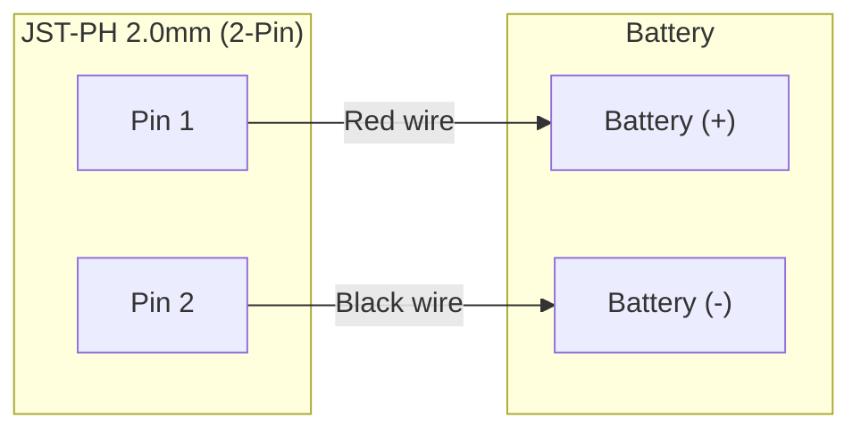
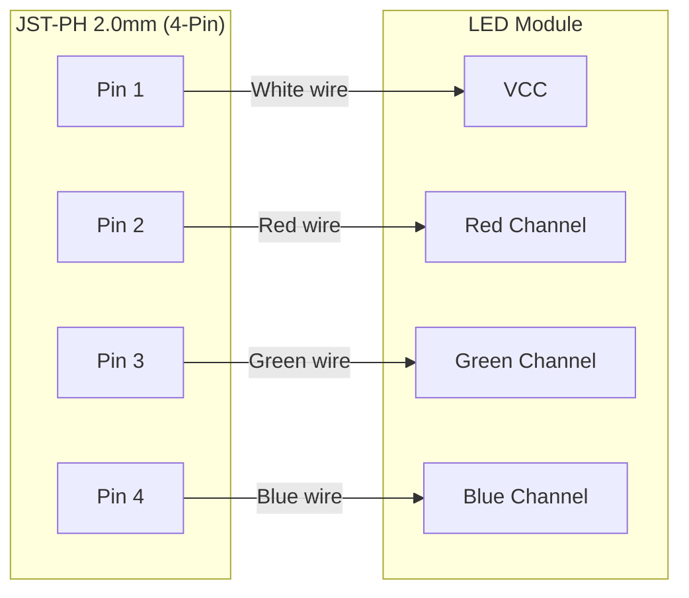

# Glasses

Finding and documentation of what was found during the glasses repair.

## Documentation

Connectors are JST-PH 2.0mm.

Wiring pinouts are as follows:

### Battery Harness (2-Pin JST-PH 2.0mm)

| Pin | Wire Color | Signal / Destination |
| :--- | :--- | :--- |
| Pin 1 | Red | Battery (+) |
| Pin 2 | Black | Battery (-) |

### LED Harness (4-Pin JST-PH 2.0mm)

| Pin | Wire Color | Signal / Destination |
| :--- | :--- | :--- |
| Pin 1 | White | VCC |
| Pin 2 | Red | Red Channel |
| Pin 3 | Green | Green Channel |
| Pin 4 | Blue | Blue Channel |

## Findings

Leads from the battery are flipped midway through, due to the pins being flipped
inside the JST connector. 

