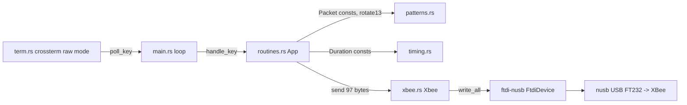

# Requirements

### Overview & Goals
Translate `glasses.c` (Ben's Halftime Toolkit — an ncurses + libftdi program that broadcasts 32-channel RGB packets through an FTDI FT232 → XBee link) into an idiomatic Rust binary in this crate, using `ftdi-nusb` for the USB/FTDI layer and `crossterm` for the terminal. Every key binding, packet, timing and quirk of the original must be preserved so the receivers (Arduino/Mrf) behave identically.

### Scope
**In scope**
- FTDI discovery (VID `0x0403`, PID `0x6001`), listing of manufacturer/description for every device, opening the first one, `57600` baud, 8 data bits / 1 stop bit / no parity.
- All ~75 pattern packets (`whitePack` … `ja1`) as Rust constants, byte-for-byte.
- All key bindings and routines of the `switch(letter)` block, including looping routines stopped by `,`, quitting with `.`, the `<`/`>` "TBA" messages, and the implicit *dark packet after every command / idle tick* behaviour.
- Helper algorithms `rotate13` and the `[`/`]` marquee shifts, including their exact (slightly odd) semantics.
- Terminal behaviour equivalent to `raw()`/`noecho()`/`nodelay()`: help banner on rows 0–13, echo of the pressed key at row 14.
- Deterministic packet framing: 96 RGB bytes + one `0x00` terminator = 97 bytes on the wire (replaces the C over-read).

**Out of scope**
- Loading patterns from the RON files in `data/` (may be added later; not part of this port).
- ratatui dashboard UI.
- New features (real dimmer/brighter, config files, CLI arguments).
- The unused `getEncodedBufferSize`/COBS remnants and `millisec()` — no behaviour depends on them beyond the 97-byte length.

### User Stories
- As the show operator, I run `cargo run` and see which FTDI devices were found and that the link was configured, exactly as the C tool reported.
- As the show operator, I press the same keys I always used (`a b c d e f g h j k l m n o p q r s t u w x y z 1–7 [ ] < >`) and the lights react identically; `,` stops a loop, `.` quits and restores my terminal.
- As a maintainer, I can read the pattern constants and routine table in separate modules instead of one 1600-line file.

### Functional Requirements
1. **Startup**: enumerate devices; print `N ftdi devices found.`, then `Checking device: i` + `Manufacturer: …, Description: …` for each; if none found, print `no ftdi devices found` and exit with code 1.
2. **Link config**: open first device; set baud 57600; set 8N1; report `baudrate set.` / `line parameters set.` (or the error) and `broadcasting.`.
3. **Main loop** (per iteration): read one key non-blockingly; echo it at row 14 (space if none); dispatch; then always write the dark packet; blank row 14; repeat until `.`.
4. **One-shot flashes** (`b e f g h j k l m r w y`): write the packet, sleep `DAB` (50 ms).
5. **One-shot sequences**: `p` rainbow-med, `s` rainbow-short, `5` Idaho spell-off, `6` Vandal fall-down/up — exact packet order and delays from the C source.
6. **Looping routines** (`c n o t u x z a q 1 2 3 4 7 [ ]`): key is sampled **once per full cycle** (exact C semantics); loop exits when the sampled key is `,`.
7. **Stateful routines**: `1`–`4` mutate their packet via `rotate13` and that state persists across invocations (C arrays are mutated in place). `[`/`]` reload `sorc` from `igPack` each time they start, then rotate by one channel per frame.
8. **Idle / unknown key**: sleep `DAB`, then the dark packet is written (constant ~20 Hz dark broadcast while idle).
9. **Shutdown**: leave raw mode, close the device, print `End of program.`.
10. **Timing constants** (µs): `DOT 100000, DASH 300000, DORK 150000, DROOL 1000000, DAB 50000, SLP 40000, SLO 750000, FAST 375000, PHISH 50000, FOURPHISH 2000000`.

### Non-Functional Requirements
- Pure Rust, no libftdi/libusb C dependency (that is what `ftdi-nusb`/`nusb` give us).
- Terminal is always restored (raw mode disabled) on normal exit, error, or panic.
- Write failures must not crash the show loop (C ignored `nbytes`); they are shown on a status row instead.
- `cargo build` warning-free on Rust edition 2024; unit tests for pure logic.

# Technical Design

### Current Implementation
- `src/main.rs` is an empty `#[tokio::main] async fn main() -> anyhow::Result<()>`.
- `Cargo.toml` already depends on `ftdi-nusb 0.3.0`, `crossterm 0.29`, `tokio` (`rt`, `rt-multi-thread`, `macros`), `anyhow`; `ratatui`/`ron`/`serde` remain unused by this port.
- `ftdi-nusb 0.3.0` API (from `~/.cargo/registry/.../ftdi-nusb-0.3.0/src`):
  - `ftdi_nusb::find_devices(vid, pid) -> Result<Vec<nusb::DeviceInfo>>` (`device_info.rs`).
  - `nusb::DeviceInfo::{manufacturer_string(), product_string(), serial_number()}` → `Option<&str>`.
  - async `ftdi_nusb::FtdiDevice::from_device_info(info, Interface::Any)`, `set_baudrate(u32)`, `set_line_property(DataBits::Eight, StopBits::One, Parity::None)`, `set_flow_control(FlowControl::Disabled)`, `write_all(&[u8])`, `shutdown()`.
  - `constants::FTDI_VID` (= 0x0403) and `constants::pid::FT232` (= 0x6001).

### Key Decisions
| Decision | Choice | Rationale |
|---|---|---|
| Pattern storage | `const` arrays in `patterns.rs` | Faithful port, verifiable against C, no runtime files (user choice). |
| UI | `crossterm` raw mode + `event::poll(Duration::ZERO)` | Direct analogue of `raw()/noecho()/nodelay()+getch()` (user choice). |
| Wire format | 97 bytes = 96 RGB + `0x00` | Preserves observed packet length; removes UB (user choice). |
| Runtime | Async `tokio` main, async `FtdiDevice`, `tokio::time::sleep` | User choice; keeps existing `#[tokio::main]`. |
| Interrupt semantics | Key sampled once per loop cycle | Exact C behaviour (user choice); so no `select!` racing is needed — a plain sequential async loop suffices. |
| Mutable pattern state | `App` struct owning copies of `snowman1/2`, `tree1/2`, `sorc` | Replaces C's in-place mutation of stack/global arrays without `static mut`. |
| Error policy | Startup errors → `anyhow` bail (exit ≠ 0); write errors during show → recorded in `App.last_error`, shown on row 15, loop continues | Matches C: fatal at init, ignored `nbytes` at runtime. |

### Proposed Changes

#### `src/timing.rs`
```rust
pub const DOT: Duration = Duration::from_micros(100_000);
pub const DASH: Duration = Duration::from_micros(300_000);
… DORK, DROOL, DAB, SLP, SLO, FAST, PHISH, FOURPHISH
```

#### `src/patterns.rs`
```rust
pub const CHANNELS: usize = 32;
pub const PACKET_LEN: usize = 96;            // CHANNELS * 3
pub type Packet = [u8; PACKET_LEN];

// one const per C array, same order/values, snake_case names:
pub const WHITE: Packet = [255,255,215, …];  // whitePack
pub const WHITE2, BLACK, RED, GREEN, BLUE, YELLOW, CYAN, MAGENTA, TREE1, TREE2,
           SNOWMAN1, SNOWMAN2, INDIGO, CORAL, DODGER, GOLD, UI1, UI2,
           TWNK1..TWNK13, RAIN1..RAIN16, GLOW, RN, IG, IT, X1..X4,
           VANDAL_I, VANDAL_D, VANDAL_A, VANDAL_H, VANDAL_O,
           FALLDOWN: [Packet; 17], JA1
pub const DARK: Packet = [0; 96];            // dPack (zero-initialised in C)

/// Exact port of rotate13(): saves ch0, shifts ch1..12 → ch0..11 and
/// ch17..28 → ch16..27, writes saved colour into ch13. (ch16 is overwritten,
/// ch28 left unchanged — replicate the C quirk verbatim, do not "fix".)
pub fn rotate13(arr: &mut Packet);
/// `[` marquee: arr.rotate_left(3)   (equivalent to the C temp/shift loop)
pub fn marquee_left(arr: &mut Packet);
/// `]` marquee: arr.rotate_right(3)
pub fn marquee_right(arr: &mut Packet);
```
`FALLDOWN` is an array so `6`/`7` can iterate `0..=16` and `16..=0` instead of 34 hand-written calls.

#### `src/xbee.rs` — FTDI/XBee link wrapper
```rust
pub const VID: u16 = ftdi_nusb::constants::FTDI_VID;   // 0x0403
pub const PID: u16 = ftdi_nusb::constants::pid::FT232;  // 0x6001
pub const BAUD: u32 = 57_600;
pub const WIRE_LEN: usize = PACKET_LEN + 1;             // 97 (was getEncodedBufferSize(96))

pub struct Xbee { dev: ftdi_nusb::FtdiDevice }

impl Xbee {
    /// find_devices → print count / per-device Manufacturer+Description → bail if empty
    pub fn list() -> anyhow::Result<Vec<nusb::DeviceInfo>>;
    /// from_device_info(first, Interface::Any); set_baudrate(BAUD); set_line_property(8,1,None);
    /// prints the same progress/errors as C (non-fatal for baud/line like the original)
    pub async fn open(info: nusb::DeviceInfo) -> anyhow::Result<Self>;
    /// copies packet into [u8; 97] with trailing 0x00 and write_all()s it
    pub async fn send(&mut self, packet: &Packet) -> ftdi_nusb::Result<()>;
    pub async fn close(mut self);   // dev.shutdown().await
}
```

#### `src/routines.rs` — key dispatch and sequences
```rust
pub struct App {
    pub xbee: Xbee,
    pub snowman1: Packet, pub snowman2: Packet, pub tree1: Packet, pub tree2: Packet, // mutable copies
    pub sorc: Packet,                       // marquee buffer
    pub last_error: Option<String>,
}

pub enum Action { Continue, Quit }

impl App {
    /// The whole `switch(letter)`; returns Quit for '.'
    pub async fn handle_key(&mut self, key: Option<char>, term: &mut Terminal) -> Action;
    async fn flash(&mut self, p: &Packet, d: Duration);         // send + sleep
    async fn send(&mut self, p: &Packet);                       // send, record error
    /// Looping helper: `loop { let k = poll_key(); body().await; if k == Some(',') { break } }`
    async fn repeat_until_comma<F>(&mut self, body: F);
}
```
Routines implemented (exact order/delays from C):
- Flash `DAB`: `b`→BLUE, `d`→DARK, `e`→GREEN, `f`→TWNK8, `g`→GOLD, `h`→TWNK9, `j`→TWNK10, `k`→CYAN, `l`→TWNK11, `m`→MAGENTA, `r`→RED, `w`→WHITE, `y`→YELLOW.
- `c` loop: X1,DARK,X2,DARK,X3,DARK,X4,DARK each `SLP`.
- `n` loop GOLD `DORK`; `o` loop WHITE `DOT`; `x` loop X1 `DROOL`.
- `p`: RAIN5 DASH, RAIN6 DAB, RAIN6 DASH, RAIN7 DAB, RAIN7 DASH, RAIN8 DAB, RAIN8 DASH, DARK DAB, DARK.
- `s`: RAIN1..RAIN4 each DASH.
- `t` and `u` loop: RED,GREEN,BLUE,BLACK each DASH, then extra DASH.
- `z` loop: X1..X4 each 2×DASH.
- `a` loop: TWNK1..TWNK12 each DROOL.
- `q` loop: RAIN1,DARK,RAIN2,DARK,RAIN3,DARK,RAIN4,DARK each SLP.
- `1`–`4` loop: `[pkt SLP; rotate13; DARK SLP] ×2` on the App's mutable copy.
- `5`: VANDAL_I SLO, D SLO, A FAST, H FAST, O SLO.
- `6`: FALLDOWN[0..=16] each PHISH, FALLDOWN[16] FOURPHISH, FALLDOWN[15..=0] each PHISH (last with no sleep).
- `7` loop: FALLDOWN[0..=16] each PHISH.
- `<`/`>`: print `getting dimmer...TBA` / `getting brighter...TBA`.
- `[`/`]`: `sorc = IG`, loop `{ marquee_left/right; send sorc; DAB }`.
- default / no key: sleep `DAB`.
- After `handle_key` returns (except Quit path mirrors C: dark is still written before exit), main writes `DARK`.

#### `src/term.rs` (small) — curses replacement
```rust
pub struct Terminal;            // RAII: enable_raw_mode in new(), disable + show cursor in Drop
impl Terminal {
    pub fn new() -> Result<Self>;
    pub fn print_banner(&mut self);           // the 14 printw lines, rows 0..13
    pub fn echo_key(&mut self, c: Option<char>); // MoveTo(0,14) + char or ' '
    pub fn status(&mut self, msg: &str);      // row 15 (used for TBA text and write errors)
    pub fn poll_key() -> Option<char>;        // event::poll(ZERO) → KeyEvent(Char) ; Ctrl-C → Some('.')
}
```

#### `src/main.rs`
```rust
#[tokio::main]
async fn main() -> anyhow::Result<()> {
    let devices = xbee::Xbee::list()?;              // prints found devices, exits 1 if none
    let xbee = xbee::Xbee::open(devices[0].clone()).await?;
    println!("broadcasting.");
    let mut term = term::Terminal::new()?; term.print_banner();
    let mut app = App::new(xbee);
    loop {
        let key = Terminal::poll_key();
        term.echo_key(key);
        let action = app.handle_key(key, &mut term).await;
        app.send(&DARK).await;
        term.echo_key(None);
        if matches!(action, Action::Quit) { break; }
    }
    drop(term);                                      // endwin()
    app.xbee.close().await;
    println!("End of program.");
    Ok(())
}
```

### File Structure
```
src/
  main.rs       (modified) startup, main loop, shutdown
  timing.rs     (new) delay constants
  patterns.rs   (new) Packet type, all constants, rotate13, marquee helpers (+ unit tests)
  xbee.rs       (new) ftdi-nusb discovery/open/config/send
  routines.rs   (new) App state + key → routine dispatch
  term.rs       (new) crossterm raw-mode wrapper (banner, echo, poll_key)
Cargo.toml      (modified) optionally `ftdi-nusb = { version = "0.3.0", features = ["tokio"] }`; unused deps left in place
glasses.c       untouched (reference)
```

### Architecture Diagram


### Risks
- **Constant transcription errors**: ~7000 literals. Mitigation: keep C layout (4 channels per line, same comments) and add a test asserting every const is 96 bytes; spot-check with a script comparing against `glasses.c` during implementation.
- **`rotate13` quirk**: port verbatim including lost channel 16 / unchanged channel 28; document in a comment; test against hand-computed expectation from the C algorithm.
- **Trailing 0x00 byte**: receivers may have relied on garbage; 0x00 is the most benign choice and is what a zeroed stack would have produced. Kept as one `WIRE_LEN` constant for easy change.
- **USB access on macOS/Linux**: `nusb` needs no driver on macOS; on Linux a udev rule may be needed. If the FTDI VCP kernel driver claims the device, `from_device_info` may fail — surface `ftdi_nusb::Error` clearly with `anyhow::Context`.
- **Key polling in async**: `crossterm::event::poll(Duration::ZERO)` is non-blocking so calling it from the async loop is safe; no `event-stream` feature required.
- **Write timeouts**: async `write_all` may error on a stalled XBee; recorded in `last_error` and shown on row 15 rather than aborting (C ignored `nbytes`).

# Testing

### Validation Approach
No FTDI hardware is available to the agent, so validation is (1) `cargo build`/`cargo clippy` for API correctness against `ftdi-nusb 0.3.0`, (2) unit tests for all pure logic, and (3) a manual comparison checklist of the C `switch` against `routines.rs`.

### Key Scenarios
- `cargo build` succeeds with edition 2024 and no warnings; `cargo test` passes.
- Every pattern constant has length 96 (`PACKET_LEN`) — compile-time via the `Packet` type, plus a test iterating an `ALL_PATTERNS` slice.
- Spot-check tests of a few constants against values from `glasses.c` (e.g. `TREE1[0..3] == [255,215,0]`, `TREE1[39..45] == [255,0,0,255,0,0]`, `TWNK7[48..51] == [80,80,5]` (C `05` octal = 5), `RAIN5[39..42] == [30,0,55]`).
- `Xbee::frame(&Packet) -> [u8; 97]` produces payload + trailing `0x00`.
- `marquee_left` on `IG` equals `IG.rotate_left(3)` and `marquee_right` is its inverse; 32 applications return to the original.
- `rotate13`: after one call on `SNOWMAN1`, `ch13 == [255,215,0]`, `ch0..12` == original `ch1..13`, `ch16..27` == original `ch17..28`, `ch28`, `ch14`, `ch15`, `ch29..31` unchanged.
- Running the binary without a device prints `no ftdi devices found` and exits non-zero (can be run by the agent).

### Edge Cases
- No key pressed → default branch sleeps `DAB` then dark packet is sent (verified by code review / an injectable `Sender` trait if cheap; otherwise documented).
- Terminal restored on early error after raw mode is enabled (RAII `Drop`).
- `Ctrl-C` in raw mode is treated as `.` so the user is never stuck in raw mode.
- `t` and `u` behave identically (as in C).

### Test Changes
- Add `#[cfg(test)] mod tests` in `patterns.rs` (lengths, rotate13, marquee, spot values) and in `xbee.rs` (framing).
- No integration tests against hardware.

# Delivery Steps

### ✓ Step 1: Port pattern data, helpers and timing constants
`patterns.rs` and `timing.rs` exist with every C array and delay reproduced byte-for-byte, with unit tests passing.

- Create `src/timing.rs` with the ten `Duration` constants (`DOT`, `DASH`, `DORK`, `DROOL`, `DAB`, `SLP`, `SLO`, `FAST`, `PHISH`, `FOURPHISH`).
- Create `src/patterns.rs` with `PACKET_LEN`, `Packet` type, `DARK`, and one `const` per C array (`WHITE`, `WHITE2`, `BLACK`, `RED`, `GREEN`, `BLUE`, `YELLOW`, `CYAN`, `MAGENTA`, `TREE1/2`, `SNOWMAN1/2`, `INDIGO`, `CORAL`, `DODGER`, `GOLD`, `UI1/2`, `TWNK1..13`, `RAIN1..16`, `GLOW`, `RN`, `IG`, `IT`, `X1..4`, `VANDAL_*`, `FALLDOWN: [Packet; 17]`, `JA1`), preserving C formatting/comments and the `05` → `5` literal.
- Implement `rotate13` verbatim (including its channel-16/28 quirk), `marquee_left`, `marquee_right`.
- Add tests: all-lengths, spot values vs `glasses.c`, `rotate13` expectation, marquee inverse.
- Register modules in `main.rs`; `cargo test` passes.

### ✓ Step 2: Implement the ftdi-nusb XBee link wrapper
`xbee.rs` discovers, lists, opens and configures the FT232 exactly like the C init block and sends 97-byte frames.

- Create `src/xbee.rs` with `Xbee::list()` using `ftdi_nusb::find_devices(0x0403, 0x6001)`, printing `N ftdi devices found.` and per-device `Checking device: i` / `Manufacturer: …, Description: …` from `nusb::DeviceInfo`; bail with `no ftdi devices found` when empty.
- Implement `Xbee::open(info)` via `FtdiDevice::from_device_info(info, Interface::Any)`, `set_baudrate(57_600)`, `set_line_property(DataBits::Eight, StopBits::One, Parity::None)`, `set_flow_control(Disabled)`, printing `ftdi_open successful`, `baudrate set.`, `line parameters set.` or the corresponding error text (non-fatal for baud/line, as in C).
- Implement `frame(&Packet) -> [u8; 97]` (payload + `0x00`) and `send()` using `write_all`; implement `close()` calling `shutdown()`.
- Optionally enable the `tokio` feature on `ftdi-nusb` in `Cargo.toml`.
- Unit test for `frame`; `cargo build` clean.

### ✓ Step 3: Implement crossterm terminal wrapper and key-routine dispatch
`term.rs` replaces curses and `routines.rs` reproduces the entire `switch(letter)` with exact packets, delays and once-per-cycle `,` sampling.

- Create `src/term.rs`: RAII `Terminal` (enable/disable raw mode, hide/show cursor), `print_banner()` with the 14 help lines, `echo_key()` at row 14, `status()` at row 15, `poll_key()` using `event::poll(Duration::ZERO)` (Ctrl-C mapped to `.`).
- Create `src/routines.rs`: `App` struct (owns `Xbee`, mutable copies of `SNOWMAN1/2`, `TREE1/2`, `sorc`, `last_error`), `Action` enum, `send()`/`flash()` helpers, `repeat_until_comma()` that samples the key once per cycle.
- Implement every key case: one-shot flashes, `p`, `s`, `5`, `6` (FALLDOWN up, hold `FOURPHISH`, down), `7`, looping `c n o t u x z a q 1 2 3 4`, `[`/`]` marquee (reload from `IG`), `<`/`>` TBA messages, default `DAB` sleep, `.` → `Quit`.
- Write errors are stored in `last_error` and shown on the status row, never fatal.

### ✓ Step 4: Wire up main loop, shutdown, and end-to-end verification
`cargo run` performs the full C program flow: device listing → open/config → banner → key loop with dark packet after every iteration → clean exit.

- Rewrite `src/main.rs`: `Xbee::list()`, `Xbee::open(first)`, print `broadcasting.`, create `Terminal` + banner, loop `{ poll_key → echo → handle_key → send DARK → blank echo }` until `Quit`, then drop terminal, `xbee.close()`, print `End of program.`.
- Ensure terminal restoration on error paths via `Drop` and `anyhow` context on startup failures.
- Run `cargo build`, `cargo clippy`, `cargo test`; run the binary with no device attached to confirm the `no ftdi devices found` path and non-zero exit.
- Final review pass comparing each C `case` to `routines.rs` (packet order, sleeps, loop termination).