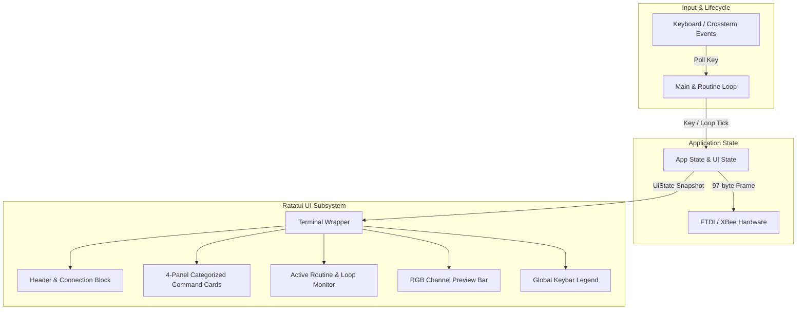

# Requirements

### Overview & Goals
The objective of this task is to replace the rudimentary crossterm printouts with a rich, modern Terminal User Interface (TUI) powered by **Ratatui 0.30**. The new interface will maximize operational efficiency, visual clarity, and control precision for the halftime light show operator during live performances, while preserving the exact microsecond transmission timing and hardware protocol behavior.

### Scope
- **In Scope**:
  - Encapsulating Ratatui `Terminal<CrosstermBackend<Stdout>>` with proper alternate screen, raw mode, and RAII cleanup in `src/term.rs`.
  - Designing a categorized multi-panel dashboard layout featuring:
    - Top header with hardware connection status, baud rate, and active transmission indicator.
    - Categorized routine cards (Flashes & Colors, Twinkles & Bursts, Loops & Animations, Holiday & Specialty Patterns).
    - Live status monitor showing the current running routine, loop state (`IDLE` vs `LOOPING`), and transmission counter.
    - Mini channel visualizer rendering RGB preview bars from transmitted packet data.
    - Notification / error log panel displaying USB write errors or status alerts.
    - Persistent bottom keybar with hotkey shortcuts.
  - Updating `src/routines.rs` and `src/main.rs` to track UI state and render frame updates synchronously during idle ticks and active routine loops.
- **Out of Scope**:
  - Modifying the underlying FTDI / XBee 97-byte packet format in `src/xbee.rs`.
  - Altering the core duration constants in `src/timing.rs`.
  - Introducing unnecessary asynchronous worker threads that add synchronization overhead.

### User Stories
- **As an operator**, I want all available hotkeys organized clearly by pattern type so that I can instantly trigger the right light sequence under pressure without memorizing disjointed key lists.
- **As an operator**, I want real-time visual confirmation of what routine is actively broadcasting and whether a loop is currently running so that I maintain total awareness of stage lighting state.
- **As an operator**, I want an immediate visual preview of transmitted RGB channel states and highlighted error notices so that I can diagnose hardware disconnection or bad transmission instantaneously.
- **As an operator**, I want to cleanly stop active loops with `,` and exit the application safely with `.` or `Ctrl-C` without leaving the terminal in a broken raw state.

### Functional Requirements
1. **Header Display**: Displays "Ben's Halftime Light Show Toolkit", current serial port configuration (FTDI 57600 8N1), and real-time transmission health indicator.
2. **Command Matrix**: Displays four structured cards grouping 20+ routines:
   - *Flashes & Solids*: `r` Red, `e` Green, `b` Blue, `g` Gold, `w` White, `m` Magenta, `y` Yellow, `k` Cyan, `d` Dark, `n` Gold On, `o` White On.
   - *Twinkles & Sparkles*: `a` Asterion Twinkle, `c` Christmas Sparkle, `q` Sparkle Cycle, `z` Slow Twinkle, `f` Twink8, `h` Twink9, `j` Twink10, `l` Twink11.
   - *Animations & Marquees*: `s` Rainbow Short, `p` Rainbow Med, `[` Marquee Left, `]` Marquee Right, `6` Falldown, `7` Channel Stagger.
   - *Holiday & Specials*: `1` Snowman 1, `2` Snowman 2, `3` Tree 1, `4` Tree 2, `5` Idaho Spelloff, `t`/`u` Test.
3. **Live Status & Visualizer Panel**:
   - Shows active routine name and elapsed activity.
   - Shows loop status badge (`[IDLE]` in dark gray / cyan, `[ACTIVE LOOP]` in bold blinking or gold).
   - Shows transmitted packet count.
   - Visualizes representative RGB channels (e.g. 16 or 32 channel segments) sampled from the active 96-byte packet buffer.
4. **Status & Error Log**: Shows transient messages (e.g. "broadcasting...", "getting dimmer...TBA") and red-highlighted USB write errors.
5. **Footer Keybar**: Persistent legend: `[,] Stop Loop` | `[.] / [Ctrl+C] Quit` | `[< / >] Dim / Brighten`.
6. **Input & Lifecycle**: Non-blocking keyboard polling with instant response; terminal restored cleanly on panic or exit.

### Non-Functional Requirements
- **Performance**: Frame draw time under 1 ms to prevent introducing perceptible latency into microsecond packet sequences.
- **Legibility**: High-contrast, utilitarian color scheme optimized for dark backstage or stadium booth environments.
- **Reliability**: Terminal state must never get corrupted or left in raw mode if the process exits or encounters an FTDI error.

# Technical Design

### Current Implementation
- `src/term.rs`: Custom `Terminal` struct using raw `crossterm` queue commands writing 14 hard-coded ASCII lines, an active key character at row 14, and an error line at row 15.
- `src/routines.rs`: `App` executes routines directly in response to single key presses. Multi-step animations and loops execute synchronous loops polling `Terminal::poll_key()`, calling `self.flash()` and `self.send()`.
- `src/main.rs`: Opens device, instantiates `Terminal` and `App`, runs a `loop` calling `app.handle_key(key, &mut term)`, broadcasts a `DARK` packet, and drops `term` on `Action::Quit`.

### Key Decisions
1. **Ratatui Terminal Architecture**: Wrap Ratatui's `Terminal<CrosstermBackend<Stdout>>` within `src/term.rs`. Provide a high-level `draw(&UiState)` method to decouple widget styling from routine control flow.
2. **Direct In-Loop Rendering**: Update `UiState` and invoke `term.draw(&self.ui_state)` inside `App::flash()`, `App::send()`, and loop iterations. This delivers instant visual feedback with zero thread synchronization overhead.
3. **RGB Channel Visualizer**: Derive a visual 16/32-segment representation from the active 96-byte RGB payload, displaying small colored blocks or ASCII bars to reflect current stage lighting output.
4. **Structured Categorization**: Group hotkey routines into logical domains (Flashes, Twinkles, Animations, Specials) using Ratatui `Block`, `Layout`, and `Table`/`Paragraph` widgets to minimize cognitive load.

### Proposed Changes

#### 1. `src/term.rs`
- Replace raw crossterm row printing with Ratatui terminal management.
- Define `UiState`:
  ```rust
  pub struct UiState {
      pub current_routine: String,
      pub is_looping: bool,
      pub last_key: Option<char>,
      pub packet_count: u64,
      pub last_packet: [u8; 96],
      pub status_message: Option<String>,
      pub is_error: bool,
  }
  ```
- Implement modular widget renderers:
  - `render_header(frame, area, &UiState)`
  - `render_command_grid(frame, area)`
  - `render_status_and_preview(frame, area, &UiState)`
  - `render_footer(frame, area)`
- Implement RAII `Drop` for `Terminal` ensuring `ratatui::restore()` or `LeaveAlternateScreen` + `disable_raw_mode()`.

#### 2. `src/routines.rs`
- Add `pub ui_state: UiState` to `App`.
- In `App::new(xbee)`: initialize default `UiState`.
- Update `App::send()` and `App::flash()` to record packet count, save `packet` slice to `ui_state.last_packet`, clear or set errors in `ui_state`, and call `term.draw(&self.ui_state)`.
- In `App::handle_key()`: set `ui_state.current_routine` and `ui_state.is_looping = true/false` before starting routines and clear when loops terminate on `,`.

#### 3. `src/main.rs`
- Ensure initial UI frame is rendered upon startup.
- Run main loop passing `term` into `app.handle_key()`.
- Drop `term` cleanly prior to closing XBee device.

### Architecture Diagram


### File Structure Changes
- `src/term.rs` - Overhauled with Ratatui backend, layout definitions, color styles, and widget rendering logic.
- `src/routines.rs` - Updated to populate `UiState` and trigger UI rendering on packet transmits.
- `src/main.rs` - Adjusted to coordinate terminal initialization and rendering lifecycle.
- `src/patterns.rs`, `src/timing.rs`, `src/xbee.rs` - Kept intact and untouched.

# Testing

### Validation Approach
Verification focuses on UI layout rendering correctness, state accuracy, loop responsiveness, and terminal stability. Automated tests will use Ratatui's `TestBackend` to verify frame rendering without requiring a physical terminal or FTDI hardware.

### Key Scenarios
1. **Initial Dashboard Render**:
   - Verify all 4 command categories, header, status monitor, visualizer, and footer render with correct borders and titles.
   - Verify initial status is `[IDLE]` and packet count is 0.
2. **Single Routine Execution (e.g. `r` Red Flash)**:
   - Verify `ui_state.current_routine` updates to "Red Flash".
   - Verify `ui_state.last_packet` reflects `RED` pattern values.
   - Verify packet counter increments.
3. **Looping Routine & Termination (e.g. `c` Christmas Sparkle -> `,` Stop)**:
   - Verify `ui_state.is_looping` becomes `true`.
   - Verify UI updates across flash sequence steps.
   - Verify pressing `,` cleanly exits the loop and restores `is_looping = false`.
4. **USB Error Indication**:
   - When hardware transmission fails, verify the error text appears styled in red in the status widget.
   - When subsequent transmission succeeds, verify error status clears.
5. **Clean Exit**:
   - Verify pressing `.` or `Ctrl-C` exits cleanly and terminal modes are completely restored without terminal garbage.

### Edge Cases
- **Small Terminal Dimensions**: Layout handles window resize gracefully using flex constraints or minimum height allocations without panicking.
- **Rapid Keyboard Input**: Buffer drain handles fast key strikes without desynchronizing state or overflowing frame draw queues.
- **Zero-allocation Channel Visualizer**: Visualizer maps the 96-byte RGB payload into color-matched blocks efficiently.

### Test Changes
- Add unit tests in `src/term.rs` using `ratatui::backend::TestBackend` to assert frame rendering stability and widget layout boundaries.
- Add unit tests in `src/routines.rs` verifying `UiState` transitions.

# Delivery Steps

### ✓ Step 1: Design UI data models and Ratatui Terminal backend wrapper
Establish core UI data structures and initialize the Ratatui terminal backend with robust terminal state lifecycle management.

- Define UI state structs (`UiState`, `LoopStatus`, `CommandInfo`, `RoutineCategory`) to store active routine details, loop state, transmission counters, and latest packet RGB samples.
- Refactor `Terminal` in `src/term.rs` to wrap `ratatui::Terminal<CrosstermBackend<Stdout>>` with RAII cleanup on `Drop`.
- Maintain non-blocking key polling via `crossterm::event::poll` supporting standard keys and `Ctrl-C` interception.

### ✓ Step 2: Implement multi-panel dashboard rendering widgets
Construct structured visual widgets providing high-density, legible operational feedback across the terminal display.

- Implement `draw_header` showing application title, FTDI hardware status, baud rate, and broadcast health.
- Implement `draw_command_grid` organizing show routines into 4 categorized cards (Flashes, Twinkles, Animations, Holiday & Specials) with highlighted hotkeys.
- Implement `draw_status_panel` displaying active routine name, loop status indicator, packet count, and timestamped error/status alerts.
- Implement `draw_channel_visualizer` rendering a color-coded ASCII/block representation of current RGB channels.
- Implement `draw_footer_keybar` rendering persistent global navigation controls (`<,>` Stop, `<.>` Quit).

### ✓ Step 3: Integrate UI state tracking and in-loop rendering in routines and main loop
Connect the light show execution loop to the Ratatui renderer for real-time visual feedback without sacrificing packet transmission timing.

- Update `App` in `src/routines.rs` to maintain `UiState` and update routine metadata before, during, and after transmissions.
- Inject terminal render invocations into `App::flash()`, `App::send()`, and routine execution loops so the visualizer updates synchronously with light show pulses.
- Update `src/main.rs` main loop to drive the initial render, pass terminal references to `App::handle_key()`, and ensure clean terminal teardown on exit.

### ✓ Step 4: Add validation tests and verify terminal resilience
Ensure terminal stability across various window dimensions, rapid keypress sequences, and hardware transmission errors.

- Add unit tests for UI state updates, command categorization, and layout bounds using Ratatui's `TestBackend`.
- Test graceful degradation and scrolling/wrapping behavior on constrained terminal dimensions.
- Verify USB write error surfacing in the dedicated status/log widget without UI panic or terminal lockup.